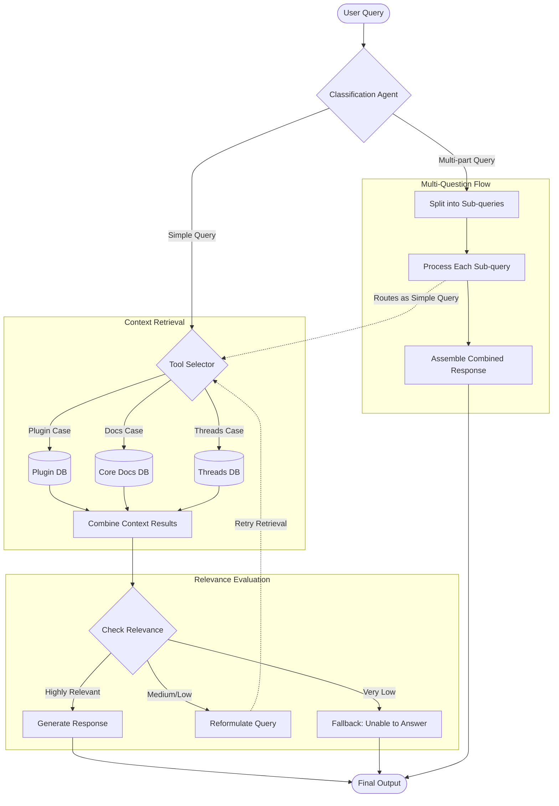

# Agentic Retrieval

Beyond the classical RAG pipeline, an agentic approach was introduced to handle complex user queries more effectively.

## Motivation

A classical RAG pipeline uses a fixed retriever over a single vector store, which limits flexibility when dealing with diverse query types. The agentic architecture empowers the LLM to dynamically select the most suitable retrieval strategy per query.

## Multi-tool Architecture

Instead of a single unified vector database, the agentic approach introduces:

- **Separate vector databases per source:** Jenkins docs, plugin docs, Discourse threads, Stack Overflow
- **Dedicated search tools** for each source
- **LLM as an agent** — chooses which tool to invoke and with what parameters

This modular design routes queries to the most relevant context while still allowing the system to combine information across sources when needed.

## Hybrid Retrieval

Each search tool implements a **hybrid strategy** combining:

1. **Semantic Search** — Vector similarity between query and chunk embeddings (FAISS)
2. **Keyword Search** — BM25 algorithm via the **retriv** library

The combination ensures both semantic relevance and lexical precision, handling:
- Natural language queries
- Technical keyword-heavy queries (config parameters, plugin names, error codes)

## Query Handling Flow

### Processing Steps

1. **Query Classification** — Agent determines if the query is simple or multi-part
2. **Tool Selection** — Retriever agent picks the appropriate search tool(s)
3. **Context Retrieval** — Selected tools perform hybrid (semantic + keyword) search and combine results
4. **Relevance Check:**
   - **High relevance** → Results passed to response generation
   - **Medium/Low relevance** → Query reformulated and retrieval retried
   - **Very low relevance** → Fallback to "unable to answer" (avoids hallucination)
5. **Multi-question assembly** — Sub-query results combined into a single final response
